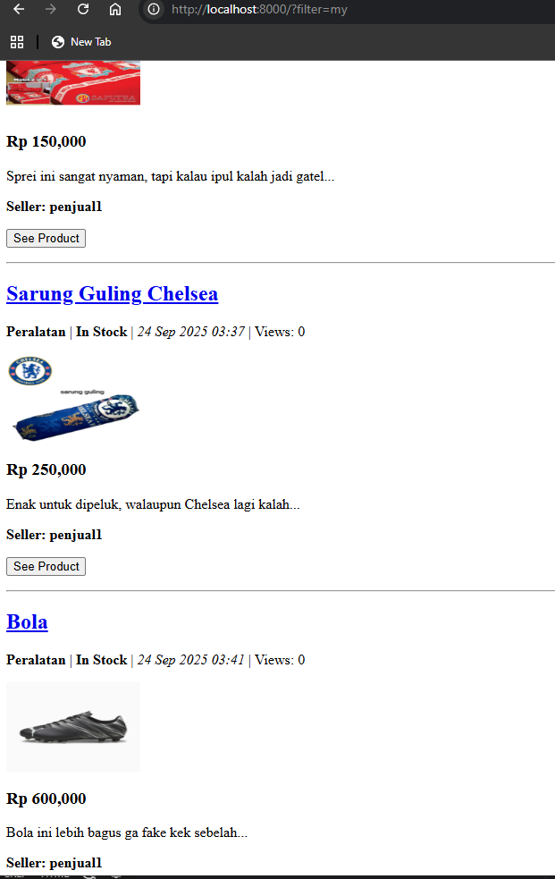

LINK DEPLOY: https://juma-jordan-anythingfootballshop.pbp.cs.ui.ac.id/
NAMA: Juma Jordan Bimo Simanjuntak
NPM: 2406435843

# 1. Apa itu Django AuthenticationForm? Jelaskan juga kelebihan dan kekurangannya.
AuthenticationForm adalah form bawaan Django yang digunakan untuk proses login pengguna. Form ini akan melakukan validasi otomatis, seperti: Mengecek apakah username terdaftar dan memverifikasi apakah password cocok dengan pengguna tersebut

Kelebihannya adalah:
1. form ini siap pakai, developer hanya perlu mengimport dan menggunakannya
2. karna form ini siap pakai, logic validasi yang dipunyai juga sudah ada
3. secara default aman, karena password akan dihashing oleh Django, sehingga admin database pun tidak dapat mengetahuinya

Kekurangannya adalah:
1. Desainnya sederhana, dari segi tampilan
2. Tidak memiliki multi-factor-auth (MFA)

# 2. Apa perbedaan antara autentikasi dan otorisasi? Bagaiamana Django mengimplementasikan kedua konsep tersebut? 
Autentikasi itu lebih ke "Who are you? atau kamu siapa?", ini adalah proses mengidentifikasi pengguna (username, password)

Otorisasi lebih ke "Kalo itu kamu, kamu boleh ngapain aja?" ini proses yang nentuin tipe-tipe user punya otoritas apa aja di web

**Di Django**
Autentikasi di Django menggunakan program bawaan dengan mengimport ***django.contrib.auth***, pertama-tama model user perlu dideklarasikan untuk menyimpan data akun, kemudian melakukan login menggunakan ***AuthenticationForm*** dan fungsi login/logout dengan ***django.contrib.auth.login, logout***

Otorisasi di Django dapat dilihat pada blok kode ***@login_required(login_url='/login')*** di views.py, blok ini memberikan info fungsi mana saja yang memerlukan login

# 3. Apa saja kelebihan dan kekurangan session dan cookies dalam konteks menyimpan state di aplikasi web?
### Cookies,
Kelebihannya adalah:
1. Mudah digunakan, sudah didukung oleh browser dan HTTP
2. Bisa menyimpan kebiasaan atau preferensi pengguna (bahasa, tema, atau login info)
3. Tidak memberatkan server, karena data tersimpan di klien

Kekurangannya adalah:
1. Ukurannya terbatas, biasanya sekitar 3-4 kb per cookiesnya
2. Rawan dicuri, jika tidak diatur dan diamankan dengan baik
3. Pengguna dapat dengan mudah memanipulasi data, karena tersimpan di klien

### Sessions,
Kelebihannya adalah:
1. Lebih aman karena data sensitif tidak disimpan langsung di browser, hanya session ID
2. Dapat menyimpan data yang lebih kompleks seperti object atau dictionary
3. Sulit dimanipulasi user karena data utama ada di server

Kekurangannya adalah:
1. Memberatkan server karena semua data session harus disimpan & dikelola server
2. Ketergantungan pada cookies/URL karena session ID biasanya tetap disimpan di cookie atau URL (kalau cookie dimatikan)
3. Kurang cocok untuk data publik misalnya preferensi tampilan yang tidak sensitif, lebih efisien disimpan di cookie

# 4. Apakah penggunaan cookies aman secara default dalam pengembangan web, atau apakah ada risiko potensial yang harus diwaspadai? Bagaimana Django menangani hal tersebut?
Jawabannya adalah tidak sepenuhnya, karena nyantanya masih banyak risiko-risiko yang bisa didapatkan namun risiko itu dapat dicegah dengan melakukan penjagaan dan pengaturan yang ketat terhadap penggunaan cookies dalam pengembangan web tersebut.
ada beberapa risiko yang perlu diwaspadi seperti,
1. Cross-Site Scripting
2. Cross-Site Request Forgery (ini sudah dibahas di tugas sebelumnya)
3. Pencurian cookie, (Session Hijack)

Cara Django menangani semua ini adalah dengan menggunakan beberapa proteksi secara default,
1. CSRF Protection: Django punya token CSRF yang wajib disertakan di form
2. Session Management: Django tidak menyimpan data sensitif langsung di cookie
3. HttpOnly: Cookie session Django diset dengan flag HttpOnly=True

# 5. Jelaskan bagaimana cara kamu mengimplementasikan checklist di atas secara step-by-step (bukan hanya sekadar mengikuti tutorial).
Memastikan virtual environment menyala
1. Saya mengedit bagian models.py dengan menambahkan atribut user pada class product
2. Kemudian saya membuat beberapa fungsi tambahan di views.py seperti login, register, logout. Membuat page html untuk menampilkan ketiga fungsi baru tersebut
3. Karena saya sudah membuat fungsi login atau register, otorisasi dapat diterapkan di beberapa fitur
4. Tidak lupa untuk menambahkan beberapa url ke urls.py sesuai dengan fungsi-fungsi baru yang telah ditambahkan
5. Menambahkan fitur Product dibuat oleh siapa? dengan memanfaatkan atribut user dan sesi login
6. Menambahkan bagian main.html dan product_detail.html dengan fitur-fitur baru yang telah dibuat
7. test di web di local host, jika aman baru push atau deploy ke web service

Screenshot penjual1

Screenshot jumajordan
