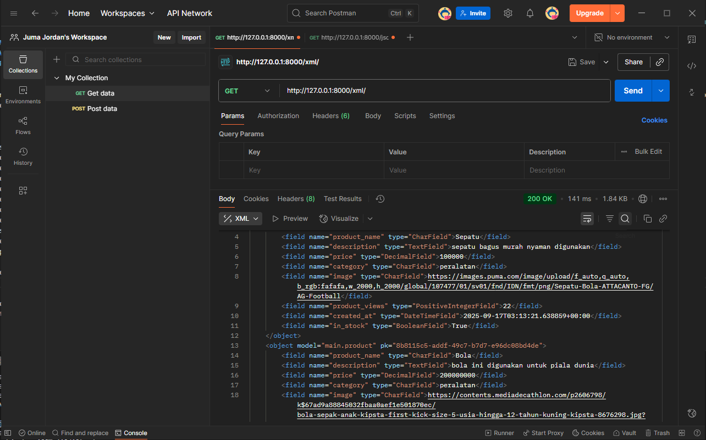
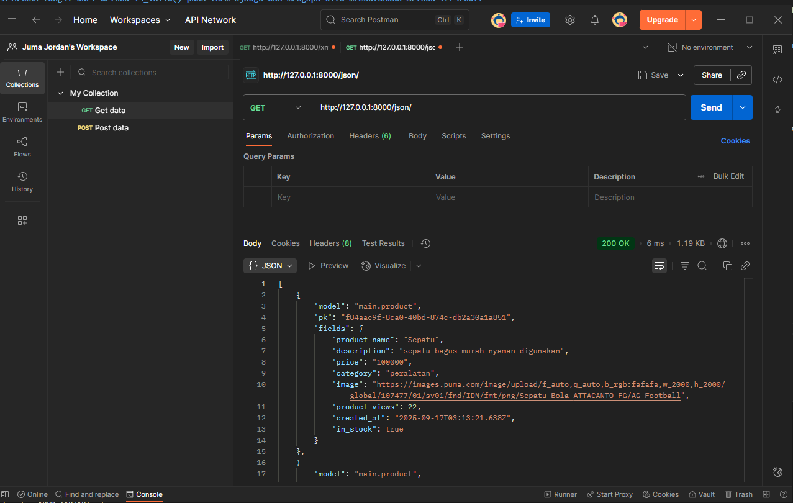

LINK DEPLOY: https://juma-jordan-anythingfootballshop.pbp.cs.ui.ac.id/
NAMA: Juma Jordan Bimo Simanjuntak
NPM: 2406435843

# 1. Jelaskan mengapa kita memerlukan data delivery dalam pengimplementasian sebuah platform?
Data delivery dibutuhkan karena itu dapat membuat kita mengakses sebuah data secara real time, jadi data dapat terupdate, keamanan dan konsistensi juga bisa didapatkan jika kita menggunakan data delivery, data delivery memastikan data yang dikirim tidak corrupt atau hilang di jalan.

# 2. Menurutmu, mana yang lebih baik antara XML dan JSON? Mengapa JSON lebih populer dibandingkan XML?
Menurut saya mengapa json lebih populer adalah karena sintaksnya itu sendiri, XML terkenal dengan sintaksnya yang seperti HTML yang banyak tag nya membuat seseorang sulit untuk memahami dan membacanya, sedangkan json dibuat dengan sintaks yang mirip dengan java script, sehingga mudah dibaca dan singkat padat jelas.

# 3. Jelaskan fungsi dari method is_valid() pada form Django dan mengapa kita membutuhkan method tersebut?
Menjalankan validasi data, "is_valid()" juga memastikan agar tipe data yang dibuat sudah sesuai dengan tipe data yang diminta '(misalnya IntegerField harus angka)'. Menyediakan error message,
jika tidak valid, form.errors berisi pesan error yang bisa ditampilkan ke user.

# 4. Mengapa kita membutuhkan csrf_token saat membuat form di Django? Apa yang dapat terjadi jika kita tidak menambahkan csrf_token pada form Django? Bagaimana hal tersebut dapat dimanfaatkan oleh penyerang?
- **Mencegah serangan CSRF**: CSRF adalah serangan di mana penyerang "menyuruh browser korban" mengirimkan request ke server tanpa sepengetahuan korban.
- **Validasi sumber request**: Dengan token, server tahu request benar-benar datang dari form sah milik aplikasi, bukan dari pihak luar.
- **Perlindungan terhadap session hijacking**: Karena Django secara default gunakan cookie session untuk autentikasi, CSRF token menambah lapisan verifikasi ekstra.
Jika tidak ada csrf_token?
Form tetap bisa submit data ke server, tapi rentan terhadap CSRF attack.
Namun Penyerang bisa: Membuat halaman HTML palsu dengan form tersembunyi. Saat user (yang sudah login di aplikasi) membuka halaman, browser otomatis kirimkan cookie session korban ke server.
Server menganggap request sah, karena cookie valid, data korban bisa diubah tanpa izin.

# 5. Jelaskan bagaimana cara kamu mengimplementasikan checklist di atas secara step-by-step (bukan hanya sekadar mengikuti tutorial).

Memastikan virtual environment menyala
1. pertama saya membuat file base.html yang berisi template utama dari page yang akan dibuat
2. kemudian, saya memodifikasi models.py dan mengisi file itu dengan paramater-parameter yang dibutuhkan untuk object Product
3. membuat 2 fungsi baru di views.py untuk membuat product dan menampilkan product di page utama dan di sub-page
4. membuat forms.py yang berisi kategori untuk mengelompokkan jenis product
5. membuat 2 file html baru, ada create_product.html dan product_detail.html 
6. menghubungkan semua file di urls.py agar dapat saling terintegrasi
7. membuat 4 fungsi baru di views.py untuk memeriksa alur xml dan json yang dibuat dan ditampilkan
8. assign link di postman untuk memastikan xml dan json yang sudah terkirim dengan baik
9. cek lagi laman apakah berfungsi dengan baik di local host
10. push ke pws dan memastikan laman berfungsi dengan baik 

Screenshot postman xml

Screenshot postman json
